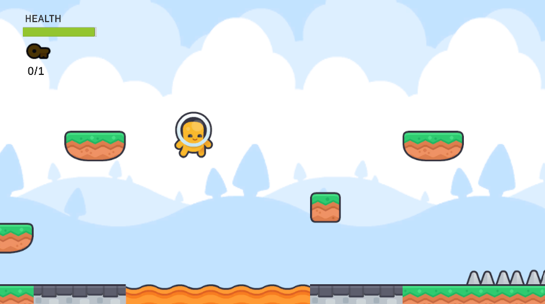
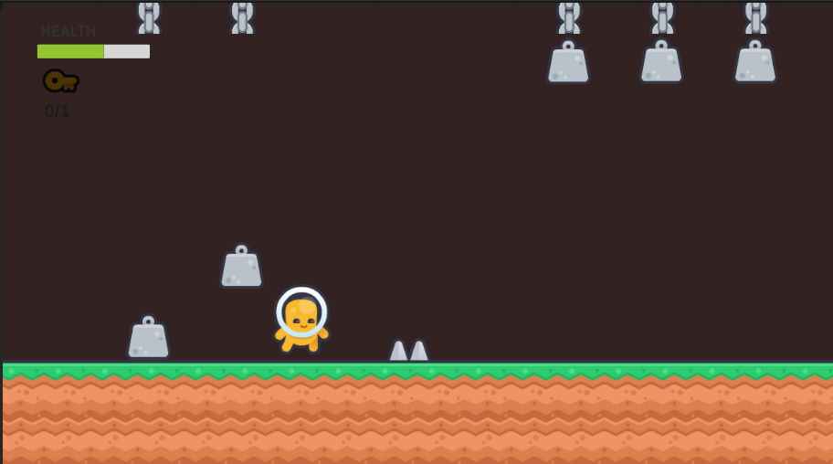

# 2D Platformer

A 2D platformer game built in **Unity and C#**, focused on responsive platforming, environmental interaction, hazards, collectibles, and gameplay systems.

The project is currently under active development, with additional enemy AI and checkpoint systems planned for future updates.

---

## 🎮 Current Features

### Player Movement

* Horizontal movement and jumping
* Ground detection using a dedicated ground-check system
* Rope climbing and rope-based movement
* Ability to leave ropes through jumping or horizontal movement

### Interactive Objects

* Interactive environmental objects that respond to player actions
* Lever-based interactions
* Moving platforms
* Spring-based jump mechanics
* Environmental objects that can affect player movement and progression

### Collectibles

* Collectible keys used for level progression
* Key collection tracked through the gameplay loop
* Collection state resets when the level is restarted

### Health & Death System

* Player health system
* Different hazards can deal different types of damage
* Death state with a dedicated **"You Died!"** UI
* Restart prompt after death
* Restarting the level reloads the current scene, resetting the current run's gameplay state

### Environmental Hazards

The current level includes several hazards:

* Spikes
* Lava pits
* Falling blocks
* Falling weights
* Timed/proximity-based bombs

Some hazards cause immediate death, while others reduce player health depending on the hazard.

---

## 📸 Gameplay

---

## 🗺️ Planned Features

The following systems are planned for future development:

* [ ] Simple enemy AI
* [ ] Checkpoint system
* [ ] Respawning from the latest checkpoint
* [ ] Additional level progression
* [ ] Additional environmental interactions
* [ ] Further gameplay polish and balancing

---

## 🔧 Development Status

**Status:** In Development

The core platforming loop and several gameplay systems are currently implemented. The project is being expanded incrementally with additional gameplay mechanics, AI, checkpoints, and polish.

---

## 🧰 Built With

* **Unity**
* **C#**
* **Unity 2D Physics**
* **Unity Tilemap System**

---

## 🚀 Future Development

The long-term goal is to develop the project into a more complete 2D platformer while continuing to expand its gameplay systems, level design, enemy behavior, and overall polish.
